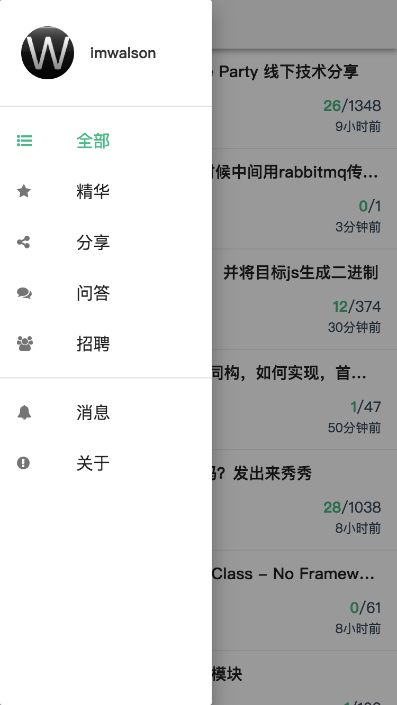
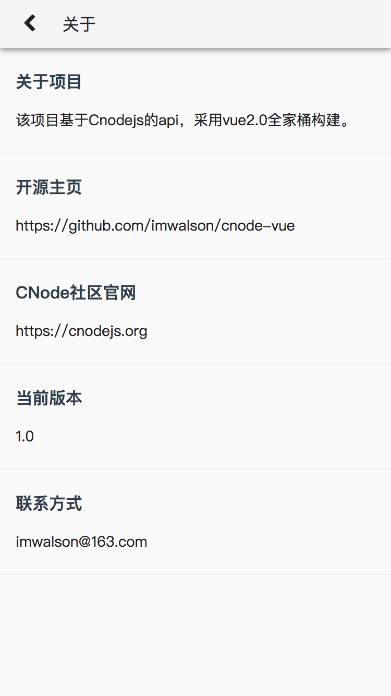

# cnode-vue

# 说明 

cnode社区vue的实现，[在线预览](https://imwalson.github.io/cnode-vue/dist/)

## 截图






## Start

``` bash
npm install
npm run dev
```

## Build
```
npm run build
```

## Thanks
数据来自 [CNode社区](https://cnodejs.org/)
